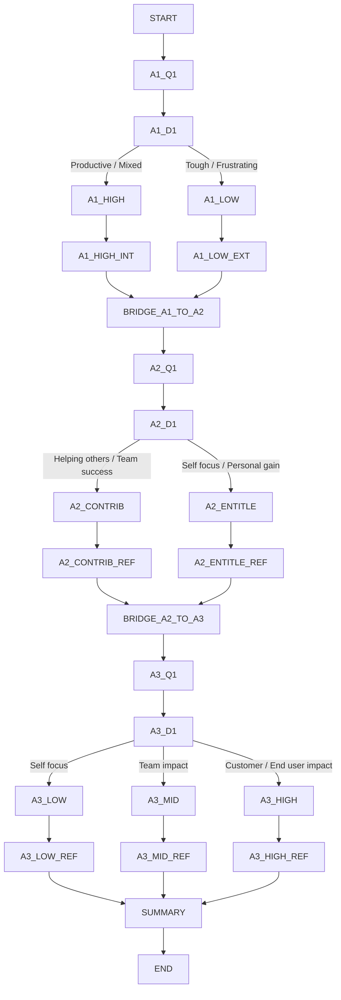

# Reflection Tree Diagram

```mermaid
%% Axis 1: Agency (Internal vs External)
%% Axis 2: Contribution vs Entitlement
%% Axis 3: Radius (Self vs Team vs Customer)

graph TD

START --> A1_Q1

A1_Q1 --> A1_D1

A1_D1 -->|Productive / Mixed| A1_HIGH
A1_D1 -->|Tough / Frustrating| A1_LOW

A1_HIGH --> A1_HIGH_INT
A1_LOW --> A1_LOW_EXT

A1_HIGH_INT --> BRIDGE_A1_TO_A2
A1_LOW_EXT --> BRIDGE_A1_TO_A2

BRIDGE_A1_TO_A2 --> A2_Q1

A2_Q1 --> A2_D1

A2_D1 -->|Helping others / Team success| A2_CONTRIB
A2_D1 -->|Self focus / Personal gain| A2_ENTITLE

A2_CONTRIB --> A2_CONTRIB_REF
A2_ENTITLE --> A2_ENTITLE_REF

A2_CONTRIB_REF --> BRIDGE_A2_TO_A3
A2_ENTITLE_REF --> BRIDGE_A2_TO_A3

BRIDGE_A2_TO_A3 --> A3_Q1

A3_Q1 --> A3_D1

A3_D1 -->|Self focus| A3_LOW
A3_D1 -->|Team impact| A3_MID
A3_D1 -->|Customer / End user impact| A3_HIGH

A3_LOW --> A3_LOW_REF
A3_MID --> A3_MID_REF
A3_HIGH --> A3_HIGH_REF

A3_LOW_REF --> SUMMARY
A3_MID_REF --> SUMMARY
A3_HIGH_REF --> SUMMARY

SUMMARY --> END
```
