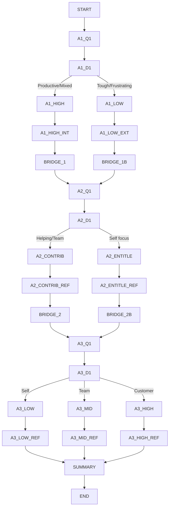

# Reflection Tree Diagram

```mermaid
graph TD

START --> A1_Q1

A1_Q1 --> A1_D1

A1_D1 -->|Productive/Mixed| A1_HIGH
A1_D1 -->|Tough/Frustrating| A1_LOW

A1_HIGH --> A1_HIGH_INT
A1_LOW --> A1_LOW_EXT

A1_HIGH_INT --> BRIDGE_1
A1_LOW_EXT --> BRIDGE_1B

BRIDGE_1 --> A2_Q1
BRIDGE_1B --> A2_Q1

A2_Q1 --> A2_D1

A2_D1 -->|Helping/Team| A2_CONTRIB
A2_D1 -->|Self focus| A2_ENTITLE

A2_CONTRIB --> A2_CONTRIB_REF
A2_ENTITLE --> A2_ENTITLE_REF

A2_CONTRIB_REF --> BRIDGE_2
A2_ENTITLE_REF --> BRIDGE_2B

BRIDGE_2 --> A3_Q1
BRIDGE_2B --> A3_Q1

A3_Q1 --> A3_D1

A3_D1 -->|Self| A3_LOW
A3_D1 -->|Team| A3_MID
A3_D1 -->|Customer| A3_HIGH

A3_LOW --> A3_LOW_REF
A3_MID --> A3_MID_REF
A3_HIGH --> A3_HIGH_REF

A3_LOW_REF --> SUMMARY
A3_MID_REF --> SUMMARY
A3_HIGH_REF --> SUMMARY

SUMMARY --> END
```
